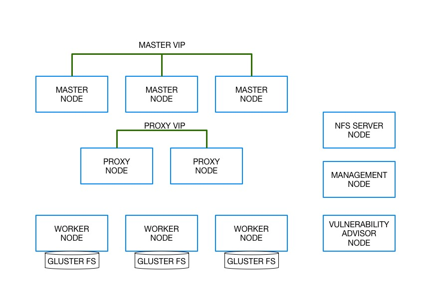

<!---
Copyright IBM Corp. 2018, 2018
--->

# IBM Cloud Private Installer

The IBM Cloud Private High Availabilty Deployment Terraform template and inline modules will provision several virtual machines, install prerequisites and install the IBM Cloud Private product within you vmWare Hypervisor enviroment.

This template will install and configure the IBM Cloud Private in an HA topology.

The components of a IBM Cloud Private deployment include:

- NFS Server (1 Node)
- Management Node (1 Node)
- Master Nodes (1, 3, or 5 combinations)
- Proxy Nodes (1 or 2 Combinations)
- Worker Nodes (Minimum 3 Nodes)
- Vulnerabilty Node (1 Node)

Image 1: IBM Cloud Private HA Node Topology>

For more infomation on IBM Cloud Private Nodes, please reference the Knowledge Center: <https://www.ibm.com/support/knowledgecenter/en/SSBS6K_3.1.0/getting_started/architecture.html>

## IBM Cloud Private Versions

| ICP Version | GitTag Reference|
|------|:-------------:|
| 2.1.0.2| 2.0|
| 2.1.0.3| 2.1|
| 3.1.0  | 2.2|
| 3.1.1  | 2.3|

<https://github.com/IBM-CAMHub-Open/template_icp_installer>

## System Requirements

### Hardware requirements

IBM Cloud Private nodes must meet the following requirements:
<https://www.ibm.com/support/knowledgecenter/en/SSBS6K_2.1.0/supported_system_config/hardware_reqs.html>

This template will setup the following hardware minimum requirements:

| Node Type | CPU Cores | Memory (mb) | Disk 1 | Disk 2 | Number of hosts |
|------|:-------------:|:----:|:-----:|:-----:|:-----:|
| Management | 4 | 16384 | 200 | n/a | 1 |
| Master  | 12 | 32768 | 300 | n/a | 1 |
| Proxy | 2 | 8192 | 200 | n/a | 1 |
| Worker  | 16 | 16384 | 200 | 300 | 1 |
| Vulnerability Advisor | 8 | 8192 | 150 | n/a | 1 |
| NFS Server | 4 | 8192 | 150 | 50 | 1 |

***Notes***
Disk 1: Base Disk Size on virtual machine
Disk 2: Additonal Disk on virtual Machine

- Worker Disk is for internal GlusterFS provision
- NFS Disk is for additonal File Systems

### Supported operating systems and platforms

The following operating systems and platforms are supported.

***Ubuntu 16.04 LTS***

- VMware Tools must be enabled in the image for VMWare template.
- Ubuntu Repos with correct configuration must be enabled in the images.
- Sudo User and password must exist and be allowed for use.
- Firewall (via iptables) must be disabled.
- SELinux must be disabled.
- The system umask value must be set to 0022.

### Network Requirements

The following network information is required:
Based on the Standard setup:

- IP Address
  - 13 IP Address's
    - 11 for Nodes
    - 2 for Cluster IPs (management and proxy VIPs)
- Netmask Bit Number eg 24
- Network Gateway
- Interface Name

## Template Variables

The following tables list the template variables.

### Cloud Input Variables

| Name | Description | Type | Default |
|------|-------------|:----:|:-----:|
| vsphere_datacenter |vSphere DataCenter Name| string |  |
| vsphere_resource_pool | vSphere Resource Pool | string |  |
| vm_network_interface_label | vSphere Port Group Name | string | `VM Network` |
| vm_folder | vSphere Folder Name | string |  |

### IBM Cloud Private Template Settings

| Name | Description | Type | Default |
|------|-------------|:----:|:-----:|
| vm_dns_servers | IBM Cloud Private DNS Servers | list | `<list>` |
| vm_dns_suffixes | IBM Cloud Private DNS Suffixes | list | `<list>` |
| vm_domain | IBM Cloud Private Domain Name | string | `ibm.com` |
| vm_os_user | Virtual Machine  Template User Name | string | `root` |
| vm_os_password | Virtual Machine Template User Password | string |  |
| vm_template | Virtual Machine Template Name | string |  |
| vm_disk1_datastore | Virtual Machine Datastore Name - Disk 1 | string |  |
| vm_disk2_datastore | Virtual Machine Datastore Name - Disk 2 | string |  |

### IBM Cloud Private Multi-Node Settings

| Name | Description | Type | Default |
|------|-------------|:----:|:-----:|
| enable_kibana | Enable IBM Cloud Private Kibana | string | `true` |
| enable_metering | Enable IBM Cloud Private Metering | string | `true` |
| worker_enable_glusterFS |  Enable IBM Cloud Private GlusterFS on worker Nodes| string | `true` |
| icp_cluster_name | IBM Cloud Private Cluster Name | string | `icpclustervip` |
| cluster_vip | IBM Cloud Private Cluster VIP | string |  |
| cluster_vip_iface | IBM Cloud Private Cluster Network Interface | string | `ens160` |
| proxy_vip | IBM Cloud Private Proxy VIP | string |  |
| proxy_vip_iface | IBM Cloud Private Proxy Network Interface | string | `ens160` |
| icp_admin_user |  IBM Cloud Private Admin Username| string | `admin` |
| icp_admin_password | IBM Cloud Private Admin Password | string | `admin` |

### IBM Cloud Private Download Settings

| Name | Description | Type | Default |
|------|-------------|:----:|:-----:|
| download_user | Repository User Name (Optional) | string |  |
| download_user_password | Repository User Password (Optional) | string |  |
| docker_binary_url | IBM Cloud Private Docker Download Location (http/https/ftp/file) | string |  |
| icp_binary_url |  IBM Cloud Private Download Location (http/https/ftp/file)| string | |
| icp_private_ssh_key | IBM Cloud Private - Private SSH Key | string | `` |
| icp_public_ssh_key | IBM Cloud Private - Public SSH Key | string | `` |
| icp_version | IBM Cloud Private Version | string | `3.1.0` |
| kub_version | Kubernetes Version| string | `1.11.0` |

### Management Node Input Settings

| Name | Description | Type | Default |
|------|-------------|:----:|:-----:|
| boot_prefix_name | Management Node Hostname Prefix | string | `ICPBoot` |
| boot_memory |  Management Node Memory Allocation (mb) | string | `16384` |
| boot_vcpu | Management Node vCPU Allocation | string | `4` |
| boot_vm_disk1_size | Management Node Disk Size (GB) | string | `200` |
| boot_vm_ipv4_address | Management Nodes IP Address | list | `<list>` |
| boot_vm_ipv4_gateway | Management Node IP Gateway | string |  |
| boot_vm_ipv4_prefix_length | Management Node IP Netmask (CIDR) | string | `24` |

### Master Nodes Input Settings

| Name | Description | Type | Default |
|------|-------------|:----:|:-----:|
| master_prefix_name | Master Node Hostname Prefix | string | `ICPMaster` |
| master_memory | Master Node Memory Allocation (mb) | string | `32768` |
| master_vcpu | Master Node vCPU Allocation | string | `12` |
| master_vm_disk1_size | Master Node Disk Size (GB)  | string | `300` |
| master_vm_ipv4_address | Master Nodes IP Address's | list | `<list>` |
| master_vm_ipv4_gateway | Master Node IP Gateway | string |  |
| master_vm_ipv4_prefix_length | Master Node IP Netmask (CIDR) | string | `24` |
| master_nfs_folders | Master Node NFS Directories | list | `<list>` |

### Proxy Nodes Input Settings

| Name | Description | Type | Default |
|------|-------------|:----:|:-----:|
| proxy_prefix_name | Proxy Node Hostname Prefix | string | `ICPProxy` |
| proxy_memory | Proxy Node Memory Allocation (mb) | string | `8192` |
| proxy_vcpu | Proxy Node vCPU Allocation | string | `2` |
| proxy_vm_disk1_size | Proxy Node Disk Size (GB) | string | `200` |
| proxy_vm_ipv4_address | Proxy Nodes IP Address's | list | `<list>` |
| proxy_vm_ipv4_gateway | Proxy Node IP Gateway | string |  |
| proxy_vm_ipv4_prefix_length | Proxy Node IP Netmask (CIDR)  | string | `24` |

### Worker Nodes Input Settings

| Name | Description | Type | Default |
|------|-------------|:----:|:-----:|
| worker_prefix_name | Worker Node Hostname Prefix | string | `ICPWorker` |
| worker_memory | Worker Node Memory Allocation (mb) | string | `16384` |
| worker_vcpu | Worker Node vCPU Allocation | string | `16` |
| worker_vm_disk1_size | Worker Node Disk Size (GB) | string | `200` |
| worker_vm_disk2_enable | Worker Node Enable - Disk 2 | string | `true` |
| worker_vm_disk2_size | Worker Node Disk Size (GB) - Disk 2 (Gluster FS) | string | `50` |
| worker_vm_ipv4_address | Worker Nodes IP Address's | list | `<list>` |
| worker_vm_ipv4_gateway |Worker Node IP Gateway  | string |  |
| worker_vm_ipv4_prefix_length | Worker Node IP Netmask (CIDR) | string | `24` |

### Vulnerability Advisor Node Input Settings

| Name | Description | Type | Default |
|------|-------------|:----:|:-----:|
| va_prefix_name | Vulnerability Advisor Node Hostname Prefix | string | `ICPVA` |
| va_memory | Vulnerability Advisor Node Memory Allocation (mb) | string | `8192` |
| va_vcpu | Vulnerability Advisor Node vCPU Allocation | string | `8` |
| va_vm_disk1_size | Vulnerability Advisor Node Disk Size (GB) | string | `150` |
| va_vm_ipv4_address | Vulnerability Advisor Nodes IP Address | list | `<list>` |
| va_vm_ipv4_gateway | Vulnerability Advisor Node IP Gateway | string |  |
| va_vm_ipv4_prefix_length | Vulnerability Advisor Node IP Netmask (CIDR) | string | `24` |

### NFS Server Node Input Settings

| Name | Description | Type | Default |
|------|-------------|:----:|:-----:|
| nfs_server_prefix_name | NFS Server Node Hostname Prefix | string | `ICPNFS` |
| nfs_server_memory | NFS Server Node Memory Allocation (mb) | string | `8192` |
| nfs_server_vcpu | NFS Server Node vCPU Allocation | string | `4` |
| nfs_server_vm_disk1_size | NFS Server Node Disk Size (GB)  | string | `150` |
| nfs_server_vm_disk2_size | NFS Server Node Disk Size (GB) - Disk 2 (NFS Size) | string | `100` |
| nfs_server_vm_ipv4_address | NFS Server Nodes IP Address | list | `<list>` |
| nfs_server_vm_ipv4_gateway | NFS Server Node IP Gateway | string |  |
| nfs_server_vm_ipv4_prefix_length | NFS Server Node IP Netmask (CIDR) | string | `24` |
| nfs_server_folder | NFS Server Node Server Folder | string | `/var/nfs` |
| nfs_server_mount_point | NFS Server Node Mount Point | string | `/mnt/nfs` |

## Template Output Variables

| Name | Description |
|------|-------------|
| ibm_cloud_private_admin_url | IBM Cloud Private Cluster URL |
| ibm_cloud_private_admin_user | IBM Cloud Private Admin Username |
| ibm_cloud_private_admin_password | IBM Cloud Private Admin Password |
